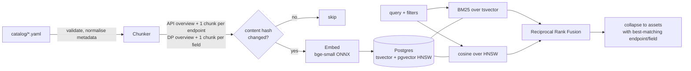

# api-data-discovery-mcp

An AI-powered discovery platform that makes the APIs and Data Products of **Nordlys Insurance**
(a fictional Nordic insurer) easy to discover, understand and access. It is exposed through the
**Model Context Protocol (MCP)**.

> Work in progress, built phase by phase. This README will grow into the full project write-up
> (architecture, measured results, security model, cost, limitations) in Phase 7.

## Status

| Phase | Scope | Status |
|---|---|---|
| 1 | Synthetic catalog: 25 OpenAPI 3.1 specs and 15 data contracts | ✅ done |
| 2 | Catalog service: FastAPI, Postgres/pgvector, idempotent ingestion, hybrid search | ✅ done |
| 3 | MCP server: tools, resources, prompts | ⏳ |
| 4 | Security: OAuth 2.1/OIDC (Keycloak), policy as code, audit, injection defence | ⏳ |
| 5 | Discovery agent and evaluation (search quality is measured here, not before) | ⏳ |
| 6 | Docker, Azure (Container Apps, Postgres, Key Vault), observability | ⏳ |
| 7 | CI, docs, ADRs, demo | ⏳ |

## Quickstart

Requires [uv](https://docs.astral.sh/uv/), Python 3.12 and Docker.

```bash
make install     # uv sync
make model       # fetch + checksum-verify the local embedding model (BAAI/bge-small-en-v1.5, ONNX)
make ingest      # start Postgres+pgvector, run migrations, ingest the catalog (idempotent)
make serve       # catalog service -> http://localhost:8000/docs
make search Q="Which API gives me open claims for Norway?"
make check       # lint + format + mypy (strict) + generator drift + all tests
```

## How search works (Phase 2)



- **Chunks**: one per API version and data product (overview), one per endpoint and per data
  product field. Each chunk repeats its parent context: API title, domain, markets, lifecycle
  and required scopes.
- **Idempotent ingestion**: file-level and chunk-level SHA-256 hashes. Re-running ingestion on an
  unchanged catalog makes no writes and no embedding calls. Changing one endpoint re-embeds only
  that endpoint and the API overview. Changing embedding model re-embeds everything. Invalid files
  are reported and skipped, and never cause data to be deleted.
- **BM25 really is BM25**: Postgres' `ts_rank` is not BM25, so the score is computed in SQL from
  tsvector term frequencies with corpus IDF (k1 = 1.2, b = 0.75).
- **Vector**: pgvector HNSW (cosine). Iterative index scans keep filtered searches complete.
- **Fusion**: reciprocal rank fusion (k = 60), so the two retrievers' incomparable scores never
  need calibrating. `mode=lexical|vector|hybrid` lets Phase 5 compare them.
- **Filters**: asset type, domain, country, major version, deprecated, PII level, applied inside
  both retrievers rather than after fusion.
- **Embeddings** sit behind a provider interface: `onnx-local` (default), `sentence-transformers`,
  `azure-openai` (text-embedding-3-small truncated to 384 dimensions), and `hashing` (tests only).

### Catalog service endpoints

| Endpoint | Purpose |
|---|---|
| `GET /v1/search?q=&mode=&domain=&country=&version=&deprecated=&pii_level=&asset_type=&limit=` | hybrid search |
| `GET /v1/apis`, `GET /v1/apis/{id}`, `GET /v1/apis/{id}/v{major}` | list, versions, details (endpoints, scopes, doc quality) |
| `GET /v1/apis/{id}/v{major}/endpoint?method=&path=` | fully dereferenced request/response schema |
| `GET /v1/apis/{id}/v{major}/spec` | raw OpenAPI document |
| `GET /v1/apis/{id}/compare?from_version=&to_version=` | structural diff incl. breaking changes |
| `GET /v1/deprecations` | deprecated APIs by sunset date |
| `GET /v1/data-products`, `GET /v1/data-products/{id}` | contracts (sample rows always withheld) |
| `GET /health/live`, `GET /health/ready` | probes (ready = DB reachable, model loaded, no un-embedded chunks) |

Errors are RFC 9457 `application/problem+json` documents with a request ID.

See [`catalog/README.md`](catalog/README.md) for what is in the catalog and which imperfections
were added on purpose.
