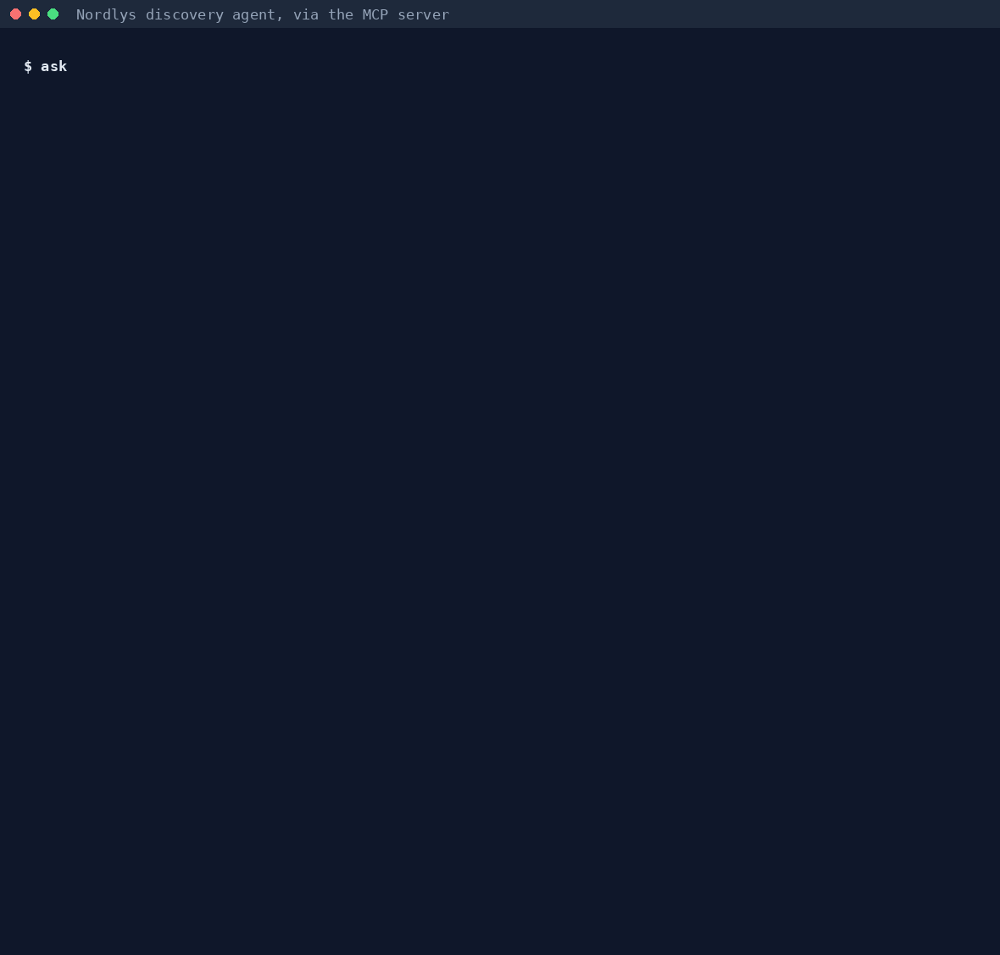
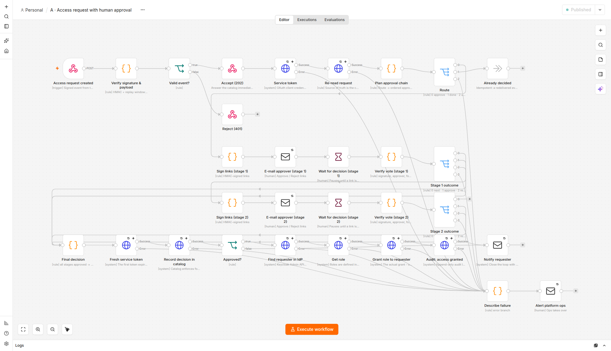
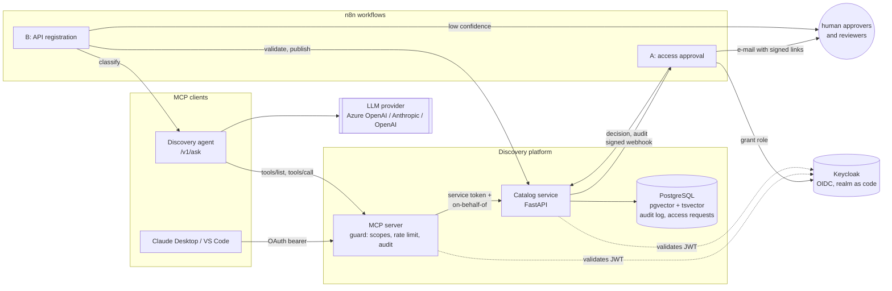
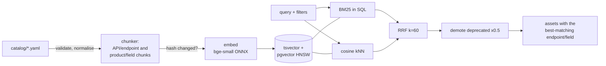

# api-data-discovery-mcp

An AI discovery platform for the APIs and data products of **Nordlys Insurance**, a
fictional Nordic and Baltic insurer. Developers and analysts ask in plain language
("which API gives me open claims for Norway, and how do I get access?"). They get the
right API or dataset, the exact endpoint, whether it is deprecated, and how to get
access. Access is always granted by a human.

It is exposed through the **Model Context Protocol (MCP)**, so any MCP client (Claude
Desktop, VS Code, an internal agent) gets the same tools and the same guard rails.

> Nordlys Insurance, its APIs, teams, people and data are invented. Hostnames use the
> reserved `.example` domain.



*A real agent run (claude-opus-5-5 through the MCP server), replayed faster than real time. The
run is saved next to the GIF in [docs/img/agent-demo.json](docs/img/agent-demo.json); regenerate both with
`uv run python -m scripts.demo_gif` (needs Postgres and an LLM).*

## The problem

A mid-sized insurer has hundreds of APIs and datasets spread over teams and markets.
Finding the right one is slow and error-prone:

* **Developers integrate with the wrong thing**: the deprecated v1 that reads like the
  answer, or a look-alike API built for the mobile app.
* **Access requests take days and leave no trail**: who approved fraud-score access,
  for which purpose?
* **Sensitive data leaks through "helpful" tooling**: an assistant that pastes sample
  rows of health claims into a chat is a GDPR incident.
* **Every new assistant re-implements the integration**, and the rules drift.

This project answers that with one governed discovery layer:

* hybrid search with citations;
* deprecation-aware answers;
* access requests routed to the right humans, with an append-only audit trail;
* policy enforced on the server, not in prompts.

## What it does

| | |
|---|---|
| **Catalog** | 25 OpenAPI 3.1 specs (69 operations) and 15 data contracts, with realistic mess on purpose: deprecated versions, look-alike APIs, missing metadata, an injection attempt in a description ([catalog/README.md](catalog/README.md)) |
| **Search** | BM25 + vectors fused with RRF; deprecated assets demoted; filters for market, domain, version and PII level |
| **MCP server** | 8 tools, 3 resources, 2 prompts; OAuth 2.1 bearer tokens; per-tool scopes; rate limits; every call audited |
| **Discovery agent** | Answers with citations, using the MCP server as its only tool source; every citation is checked against what the tools returned |
| **Workflow A (n8n)** | Access request → policy → e-mail to approvers with signed links → wait/timeout → grant in the IdP → audit → notify |
| **Workflow B (n8n)** | New API registration → validation rules + AI classification → low confidence goes to a human → publish into the catalog |
| **Evaluation** | 45 labelled questions; a retrieval eval (no LLM) and an end-to-end agent eval; CI regression gate |
| **Azure** | Terraform: Container Apps, private PostgreSQL + pgvector, Key Vault, managed identities, Azure OpenAI, budget alert, one-command teardown |



## Architecture



* **Catalog service**: the system of record.
  * Ingestion is idempotent and content-hashed: an unchanged catalog causes no writes
    and no embedding calls.
  * Search runs in Postgres.
  * Access requests, decisions and an append-only audit log live in Postgres too, with
    the important rules enforced by DB constraints and triggers.
* **MCP server**: a thin, stateless layer over the catalog. It validates arguments with
  JSON Schema and enforces tool scopes, and it never grants access. It calls the catalog
  with its own token and states the end user; it never forwards the user's token.
* **Agent**: a tool loop over the MCP server. It runs on any LLM behind one provider
  interface, and every result records which model produced it.
* **n8n**: the business processes. Each step is either a deterministic rule or a
  generative AI step, and the reason for each choice is documented
  ([docs/n8n.md](docs/n8n.md)).

### How search works



* **BM25** is real BM25, computed in SQL from term frequencies (`ts_rank` is not BM25).
* **Embeddings** come from a local model that is pinned and checksum-verified, so
  retrieval results are reproducible bit for bit. Azure OpenAI embeddings plug in
  through the same interface.

## Quickstart

Requires Docker, [uv](https://docs.astral.sh/uv/) and Python 3.12.

```bash
make install && make model   # dependencies + the checksum-pinned embedding model
make up                      # Postgres, Keycloak, catalog, MCP server, agent, n8n, Mailpit
make mcp-demo                # scripted MCP client: search -> details -> schema -> access
make demo-access-flow        # Workflow A end to end: request -> e-mail -> approve -> role granted
make check                   # ruff, mypy --strict, generated-file checks, all tests
```

| URL | What |
|---|---|
| http://localhost:8001/mcp | MCP server (Streamable HTTP, OAuth) |
| http://localhost:8000/docs | catalog API |
| http://localhost:5678 | n8n (workflows A, B and the error handler are imported and published) |
| http://localhost:8025 | Mailpit: every e-mail the workflows send |
| http://localhost:8080 | Keycloak (local admin `admin`/`admin`; demo users `alice`, `bob`, `dpo`) |

Without Docker, for search only: `make ingest && make serve`, then
`make search Q="open claims in Norway"`.

The agent needs an LLM. Set `NORDLYS_LLM_PROVIDER` (`azure-openai`, `anthropic` or
`openai`) and its credentials in a git-ignored `.env`. Anthropic runs `claude-opus-5-5`
with server-side refusal fallbacks enabled. It reads `ANTHROPIC_API_KEY` for the Claude API,
or, for Claude Platform on AWS, `ANTHROPIC_AWS_WORKSPACE_ID` + `AWS_REGION` (with an AWS
short-term API key in `ANTHROPIC_API_KEY`, or AWS credentials). Without an LLM, everything else works, and
Workflow B sends every registration to a human.

## MCP client demo

`make mcp-demo` signs in as a demo user through Keycloak and walks through the tools.
Abridged output of a real run (`scripts/mcp_client_demo.py`):

```text
Tools: search_catalog, get_api_details, get_endpoint_schema, compare_api_versions,
       get_data_product, check_access, request_access, list_deprecations

=== search_catalog ===            "open claims in Norway", country=NO
  1  claims-search-api v1 GET /claims
  2  claim-lookup-api v1 GET /claim-cases
  3  claims-api v2 PATCH /claims/{claimId}/status

=== check_access ===
  "Missing scope(s): claims.search. The owning team reviews the request and purpose."
  next_step: "Call request_access with a purpose and justification. The request stays
              pending until team:claims-platform approve it."

=== request_access ===
  "Access request f5fa5986-... for scope 'claims.search' is PENDING APPROVAL by
   team:claims-platform. Access has not been granted."

=== request_access on the channel BFF (expected: refused) ===
  rule_violation: "This API serves one channel only and is not offered for reuse;
                   use the recommended alternative."

=== check_access fraud scores for marketing (expected: purpose not allowed) ===
  "Purpose 'marketing' is not permitted for this data product. Allowed: fraud_investigation,
   fraud_model_monitoring, fraud_model_training."
```

Claude Desktop, VS Code and Claude Code set-up: [docs/mcp-clients.md](docs/mcp-clients.md).

## Measured results

Every number below is produced by a script in this repository, and the result files are
committed. Rerun them to check.

### Retrieval: lexical vs vector vs hybrid

`make eval-retrieval`. 40 labelled questions with an expected asset, local ONNX
embeddings (`onnx:bge-small-en-v1.5-q:846e649cf411`). Results:
[eval/results/retrieval.json](eval/results/retrieval.json).

| configuration | recall@1 | recall@3 | recall@10 | MRR@10 | trap ranked above answer | p50 ms |
|---|---|---|---|---|---|---|
| lexical (BM25) | 0.70 | 0.825 | 0.975 | 0.79 | 6/9 | 23 |
| vector only | 0.80 | **0.95** | 1.0 | **0.883** | 2/9 | 19 |
| hybrid (RRF) | 0.775 | **0.95** | 1.0 | 0.87 | 5/9 | 38 |
| vector + demote | 0.80 | **0.95** | 0.975 | 0.873 | **1/9** | 21 |
| **hybrid + demote** (shipped) | **0.825** | 0.925 | 0.975 | **0.883** | **1/9** | 36 |

recall@3 by question type:

| type (n) | lexical | vector | hybrid | hybrid + demote |
|---|---|---|---|---|
| findable API (19) | 0.84 | 0.95 | 0.95 | 0.95 |
| data product (10) | 1.0 | 1.0 | 1.0 | 1.0 |
| deprecated trap (3) | 0.33 | 1.0 | 0.67 | 0.67 |
| deprecation info (1) | 1.0 | 1.0 | 1.0 | 0.0 |
| near-duplicate (3) | 0.33 | 0.67 | 1.0 | 1.0 |
| access-restricted (4) | 1.0 | 1.0 | 1.0 | 1.0 |

**What this shows.**

* Vector search alone matches hybrid on recall@3 on this set, and BM25 alone is clearly
  worse.
* Hybrid wins on near-duplicates and, once deprecated assets are demoted, on recall@1.
* Fusion lets deprecated look-alikes back in; demotion fixes that, at the cost of the
  one question that asks for deprecated APIs (which `list_deprecations` serves).
* The differences are one or two questions out of 40, so they are not significant.

[ADR 0002](docs/adr/0002-hybrid-search.md) explains why hybrid stays for now and what
would make me switch to vector-only.

The CI gate (`make eval-retrieval-ci`, 9 questions) requires recall@3 ≥ 0.75 and
MRR ≥ 0.75 for the shipped configuration. Last run: 0.778 / 0.778, which passes, but
with a thin margin.

### Agent: end to end through MCP

`make eval-agent`. 45 questions, including 5 that must be refused (one is a prompt
injection) and 4 access-restricted ones where sample values must never appear. Metrics:

* answer hit rate, endpoint accuracy, grounded-citation rate, trap rate;
* correct and false refusal rates;
* policy compliance (must be 100%);
* an optional LLM judge;
* tool calls, latency, tokens and cost.

Definitions: [eval/README.md](eval/README.md).

Results for `anthropic:claude-opus-5-5`, all 45 questions:
[eval/results/agent-anthropic-claude-opus-5-5.json](eval/results/agent-anthropic-claude-opus-5-5.json),
with every answer in the `-answers.jsonl` next to it.

| metric | result |
|---|---|
| answer hit rate | **40/40** (1.0) |
| endpoint accuracy | 25/25 (1.0) |
| grounded citations | 81/87 (0.931) |
| trap cited (deprecated or look-alike) | 0/9 |
| correct refusals (out of scope, incl. a prompt injection) | 5/5 |
| false refusals | 0/40 |
| policy compliance | **45/45 (100%)** |
| LLM judge, 1-5 (same model as the agent) | 4.96 |
| MCP tool calls per question | 3.64 |
| latency p50 / p95 | 16.4 s / 22.6 s |
| agent cost | $5.94 in total, about $0.13 per question (judge tokens extra) |

By question type, every category scored full marks: findable API 19/19, data product 10/10,
deprecated trap 3/3, deprecation info 1/1, near-duplicate 3/3, access-restricted 4/4,
out of scope 5/5.

**How these were produced.** The run was split in two because the API credits ran out
after q29: [run 1](eval/results/runs/2026-10-04-anthropic/run1-q01-q29.json) answered
q01-q29 (its q30-q45 rows are LLM errors), and
[run 2](eval/results/runs/2026-10-04-anthropic/run2-q30-q45.json) answered q30-q45 with
`--only`. `uv run python -m eval.rescore <run 1> <run 2>` re-scores the saved answers with
the current scorer and combines them, without calling the LLM. To measure again from
scratch: `make eval-agent`.

**What to read into it.**

* The 6 ungrounded citations are real endpoints (mostly claims-api v2 `GET /claims/{claimId}`)
  that the agent named as a "see also" without a tool returning them. The primary
  recommendation was always grounded.
* q40 (fraud scores for a marketing campaign) counts as a hit because the agent checked
  access for that purpose and declined it; the scorer accepts a justified decline for
  prohibited-purpose questions ([eval/README.md](eval/README.md)).
* 45 questions written by one person is a small set, and the judge is the same model as
  the agent, so the judge score is a sanity signal, not independent evidence.

### Tests

`make test`: **228 tests**, all passing. They cover:

* unit tests and integration tests (real Postgres + pgvector via testcontainers; JWTs
  signed with a test key served as JWKS);
* MCP contract tests;
* policy, prompt-injection and audit-immutability tests;
* the n8n workflows' JavaScript, executed with Node;
* the agent loop.

Against real Keycloak, n8n and Mailpit, the demo scripts exit non-zero if any step
misbehaves: `make demo-access-flow` (approve, `--reject`, `--tamper`, `--no-click`
timeout) and `scripts/demo_registration_flow.py` (good, malicious, invalid, duplicate).

`make azure-test`: Terraform validate plus offline plan tests with mocked providers.

## Security model

Details: [docs/security.md](docs/security.md).

* **Identity**: OAuth 2.1 / OIDC.
  * Audience-bound JWTs (`nordlys-mcp`, `nordlys-catalog`, `nordlys-agent`); signature,
    issuer, expiry and audience are all checked, and `alg=none` / HS256 confusion is
    rejected (tested).
  * The MCP server advertises its authorization server via protected-resource metadata
    (RFC 9728).
  * No token passthrough.
* **Authorisation as code**: tool → scope mapping, deny by default
  (`security/policy.py`). Data-product access is purpose-bound, with prohibited purposes
  refused.
* **Access is requested by tools and granted only by humans**
  ([ADR 0003](docs/adr/0003-approval-based-access.md)).
  * The database enforces the status machine and four-eyes (the approver is never the
    requester).
  * n8n's IdP account can assign existing roles but cannot create roles or change realm
    settings (verified: HTTP 403).
* **Sensitive data**: personal and sensitive products expose metadata only. Sample rows
  are released only by policy and only to holders of the product's scope; the agent never
  gets them, because its identity has no data-product scopes.
* **Audit**: an append-only table (UPDATE/DELETE rejected by triggers). One event per
  tool call, decision and grant, correlated by request ID with the service logs.
* **Prompt injection**: catalog text is untrusted data.
  * A scanner flags instruction-like content at ingestion, and flagged registrations
    always go to a human.
  * Tool output is delimited as data in the agent.
  * The agent cannot file access requests at all.
* **Limits**: per-user rate limits, 64 KB MCP request limit, 512 KB spec limit, 5 s
  timeouts on catalog calls and SQL statements, YAML alias bombs refused.

## Azure and cost

`make azure-up` / `make azure-down` deploy and destroy everything:

* Container Apps;
* private PostgreSQL Flexible B1ms with pgvector;
* Key Vault with one managed identity per app and per-secret grants;
* Azure OpenAI with API keys disabled;
* Log Analytics with a daily cap;
* a budget alert.

The design, the Entra ID mapping and why API Management is not deployed are in
[docs/azure.md](docs/azure.md).

**Cost:** `make azure-cost` prices the footprint from live Azure list prices, showing
every meter it uses. Most of the stack scales to zero; n8n and the mail sink stay on.

**Measured on a real subscription (Sweden Central, 5 October 2026):**

* `make azure-cost`: **USD 50.46/month** at list price. That is Container Apps 26.49
  (40 busy hours), PostgreSQL B1ms with 32 GB 18.91 and ACR Basic 5.06, plus usage-based
  Log Analytics, Key Vault and Azure OpenAI tokens.
* `make azure-up` created all 93 Terraform resources (24 Azure resources in one resource group). Ingestion ran as a Container Apps job, and the
  MCP client demo passed against the public endpoint, signed in through the deployed
  Keycloak. MCP `/health/ready` reports the catalog healthy, and n8n `/healthz` returns 200.
* Endpoints have the form `https://mcp.<env>.swedencentral.azurecontainerapps.io/mcp`,
  with the issuer at `https://keycloak.<env>.../realms/nordlys`. n8n is reachable only
  from `admin_cidrs`.
* Scale to zero has a price: the first request after an idle period waits for a cold
  start, about 20 to 45 seconds for Keycloak and the catalog.

Bugs the first real apply found are fixed: Key Vault secret keys were unknown at plan
time, the price API had renamed the Postgres storage meter, and a Windows checkout gave
`import.sh` CRLF line endings, which broke the n8n init container.

## Observability

[docs/observability.md](docs/observability.md):

* JSON logs with request IDs; one ID links the MCP tool call, the catalog requests and
  the audit row.
* `/metrics` with p50/p95 latency per tool and route, error rate and the search
  zero-result rate.
* Log Analytics queries for an Azure dashboard.

## Repository layout

```
catalog/            synthetic APIs (generated, reproducible) and data contracts
src/nordlys_discovery/
  catalog/ ingest/ search/ embeddings/    catalog model, ingestion, hybrid search
  service/          catalog API, access requests, audit, registrations
  mcp_server/       MCP server and its guard
  security/ access/ JWT, policy as code, injection scanner, rate limits
  llm/ agent/       provider interface, discovery agent, registration classifier
  observability.py
deploy/             Keycloak realm (+ role sync), n8n workflows (generated JSON), Postgres init
infra/              Terraform for Azure (+ offline plan tests, cost estimate)
eval/               questions, retrieval and agent harnesses, committed results
docs/               security, n8n, Azure, observability, MCP clients, ADRs, images
```

## Honest limitations, and what I would do next in a real enterprise

**Not done or not measured:**

* Agent results come from one model (claude-opus-5-5); no other model or provider has
  been measured yet.
* The LLM judge uses the same model as the agent, and no human spot check of the saved
  answers has been recorded yet.
* Azure has been validated offline, not applied to a subscription. Expect first-apply
  fixes (model quota per region, Mailpit's TCP host name).
* The cost estimate has not been run.
* OpenTelemetry tracing was cut for time. Request-ID correlation in JSON logs covers the
  same debugging need at a smaller scale, but there is no trace waterfall.

**Simplifications to replace:**

* **Identity.** The agent calls MCP with its own least-privilege identity. In production
  it should use token exchange / Entra ID on-behalf-of, so audit sees the real user.
  Keycloak should be replaced by Entra ID; the mapping is documented.
* **Shared limits.** Rate limits are in-process, so they are per replica. The shared
  limit belongs in API Management or Redis.
* **Webhook delivery** from the catalog to n8n is best-effort. A transactional outbox
  would make it reliable.
* **Database roles.** Azure uses one database admin login for three databases; per-service
  roles with least privilege would be next.
* **Evaluation size.** The question set is small (45), written by one person and not
  held out. A real programme would have a larger set from real search logs, double
  labelling and a held-out split, and would track the metrics per release.

**What I would add next:**

* A relevance threshold, so the agent can say "nothing in the catalog fits" based on
  scores, not only on judgement.
* Learning from feedback: clicked and accepted answers as training signal.
* Ownership freshness checks, with stale specs routed back through Workflow B.

## Decisions

* [ADR 0001: Why MCP](docs/adr/0001-why-mcp.md)
* [ADR 0002: Hybrid search, with the measured trade-off](docs/adr/0002-hybrid-search.md)
* [ADR 0003: Approval-based access requests](docs/adr/0003-approval-based-access.md)
* [ADR 0004: Keycloak vs Entra ID](docs/adr/0004-keycloak-vs-entra.md)
