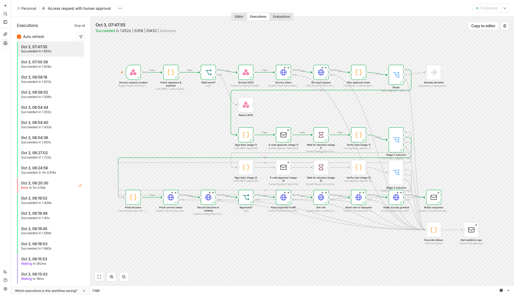
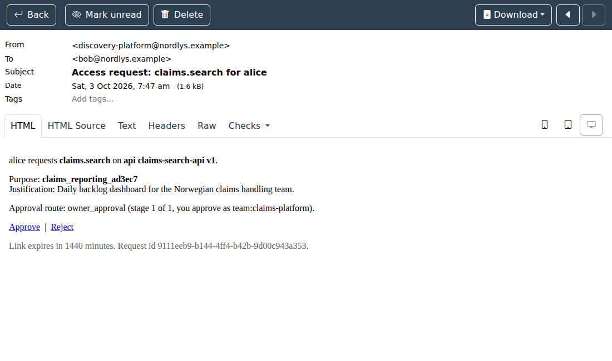
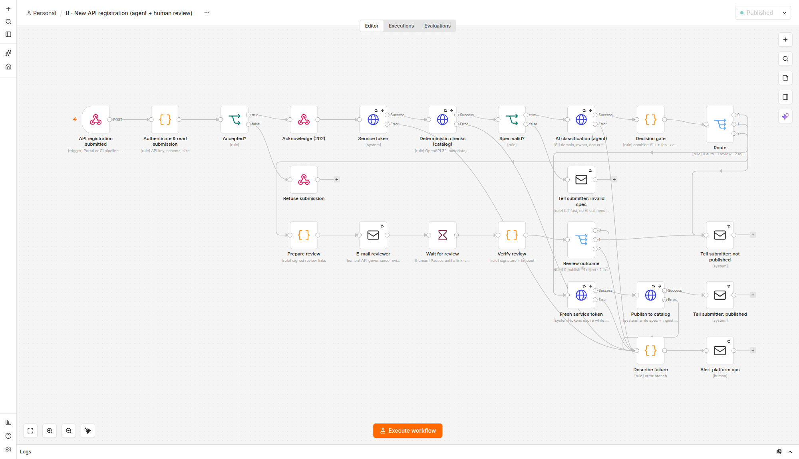
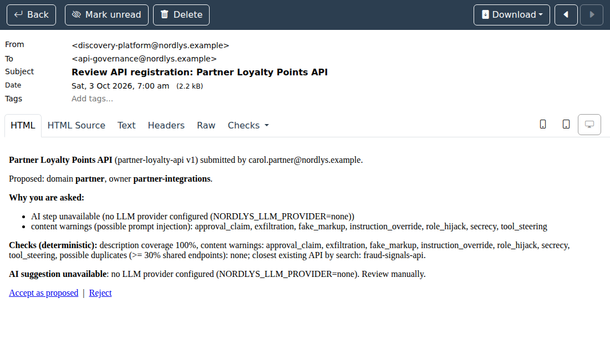

# n8n workflows

n8n is the **workflow layer**: it orchestrates the steps that involve people, waiting and
other systems (e-mail, the identity provider), which the catalog and MCP server should not
do themselves. The two workflows are generated from `deploy/n8n/build_workflows.py`, exported
to `deploy/n8n/workflows/*.json`, and imported and published automatically by `make up`.

Every node carries a label in its subtitle:

| Label | Meaning |
|---|---|
| **[rule]** | deterministic: code or a fixed check, with the same output for the same input every time |
| **[AI]** | generative: an LLM produces a suggestion, which is always advisory |
| **[human]** | a person decides, or the workflow waits for one |
| **[system]** | a call to another system (catalog, Keycloak, SMTP) |
| **[trigger]** | how the workflow starts |

## Why each step is deterministic or generative

The rule used in both workflows: **anything that grants, denies, publishes or protects is
deterministic. The LLM is used only where language understanding adds value, and its output
is a suggestion that a deterministic gate checks.**

| Step | Kind | Why |
|---|---|---|
| Verify webhook signature, replay window, payload schema | rule | Security checks must be exact and explainable. An LLM cannot verify an HMAC. |
| Re-read the request from the catalog | rule | The catalog is the source of truth; the event payload might be stale or forged. |
| Map approval route to approvers (owner, DPO, InfoSec), four-eyes | rule | Who may approve is policy, and policy must be predictable and auditable. |
| Sign and verify approve/reject links | rule | Cryptography, not judgement. |
| Approve or reject the access request | **human** | Regulated decision (GDPR, insurance data). Never automated. |
| Timeout to rejection ("expired") | rule | Rules may auto-*deny*; nothing auto-*grants*. |
| Grant the role in the IdP | system, after the human decision | The only path to a grant goes through a recorded human approval (asserted by a test). |
| OpenAPI 3.1 validation, metadata extraction, doc coverage, version conflict | rule | Objective facts; an LLM would only add noise and cost. |
| Prompt-injection screening | rule | A deterministic tripwire that cannot itself be prompt-injected. |
| Duplicate detection (endpoint overlap + search) | rule | Measurable overlap; the search ranking is reproducible. |
| Classify domain, suggest owner team, critique the documentation | **AI** | This needs reading comprehension over free text, which is where an LLM is better than rules. |
| Decision gate: auto-accept or human review | rule | The AI's confidence is *one input*. Disagreement with declared metadata, low confidence, warnings, poor docs or duplicates all force human review. |
| Review the registration | **human** | Accountable ownership of a new API is a business decision. |

**What happens without an LLM:** the AI step answers `available: false` and the gate sends
every registration to human review. The platform degrades to "slower", never to "unsafe".
This is how the stack runs by default (`NORDLYS_LLM_PROVIDER=none`), and how every demo run
recorded in this repository was made.

---

## Workflow A: access request with human approval

**Trigger:** `request_access` over MCP → the catalog stores a `pending_approval` request
and POSTs a signed event (`X-Nordlys-Signature: sha256=HMAC(secret, ts.body)`) to n8n.

| # | Node | Kind | What it does |
|---|---|---|---|
| 1 | Access request created | trigger | Webhook `POST /webhook/access-request-created`, raw body kept for signature checking. |
| 2 | Verify signature & payload | rule | HMAC over `timestamp.rawBody` (constant-time compare), timestamp within 5 minutes, pending request with approvers. |
| 3 | Valid event? → Reject (401) / Accept (202) | rule | Bad events get 401. Good events are acknowledged at once, so the catalog never waits on humans. |
| 4 | Service token | system | OAuth client credentials for `nordlys-n8n`; retries ×3, 10 s timeout. |
| 5 | Re-read request | rule | GET the request from the catalog: the catalog is the source of truth. |
| 6 | Plan approval chain | rule | Route → ordered approvers (team lead, then DPO or InfoSec where required). The requester is never routed to themselves. Unroutable → ops. |
| 7 | Route | rule | 0 start approvals · 1 already decided (redelivered event, idempotent) · 2 unroutable. |
| 8 | Sign links (stage n) | rule | Approve/Reject URLs = n8n's own signed resume URL + our HMAC over (execution, stage, approver, decision). Requester text is HTML-escaped. |
| 9 | E-mail approver (stage n) | human | Approval e-mail (Mailpit locally). |
| 10 | Wait for decision (stage n) | human | Pauses until a link is clicked or `NORDLYS_APPROVAL_TIMEOUT_MINUTES` (default 24 h) passes. |
| 11 | Verify vote (stage n) | rule | Checks the signature, that the approver matches the stage, and that the approver is not the requester. Timeout → `expired`. Tampering → `invalid` (ops alerted, nothing decided). |
| 12 | Stage n outcome | rule | Next stage · final approve · reject/expire · invalid. |
| 13 | Final decision | rule | `approved` only if **every** stage was approved through a verified link. |
| 14 | Fresh service token | system | The first token expired while humans were deciding. |
| 15 | Record decision in catalog | system | `POST /v1/access-requests/{id}/decision` on behalf of the approver. The catalog enforces `access.approve` and four-eyes, and audits the decision. |
| 16 | Approved? | rule | Only the approved branch continues to the grant. |
| 17–19 | Find requester in IdP → Get role → Grant role to requester | system | Keycloak Admin API: assigns the realm role named after the scope (e.g. `claims.search`). The roles are defined in the realm-as-code (one per grantable catalog scope, kept in sync by `deploy/keycloak/sync_roles.py`), so n8n's service account needs only `manage-users` and `view-realm`: it can assign existing roles but cannot create roles or change realm settings. A scope without a role goes to the error branch. |
| 20 | Audit: access granted | system | Append-only audit event `access_grant.applied`. |
| 21 | Notify requester | system | Approved, rejected or expired, with the reason. |
| — | Describe failure → Alert platform ops | rule / human | Every HTTP node's error output and every invalid or unroutable case ends here. The request is untouched. |
| — | Workflow setting `errorWorkflow` | — | Anything not routed above triggers workflow **Z · Error handler**, which alerts ops. |

Retries: every HTTP and e-mail node retries 3 times, 2 s apart. Timeouts: 10 s per HTTP
call, plus the approval timeout on each Wait.

## Workflow B: new API registration (agent in a business process)

**Trigger:** a portal or CI pipeline POSTs `{submitted_by, spec}` with an API key.

| # | Node | Kind | What it does |
|---|---|---|---|
| 1 | API registration submitted | trigger | Webhook `POST /webhook/api-registration`. |
| 2 | Authenticate & read submission | rule | API key (constant-time compare), required fields, 512 KB limit. |
| 3 | Accepted? → Refuse / Acknowledge (202) | rule | Returns a tracking id at once. |
| 4 | Service token | system | Token with audiences catalog **and** agent. |
| 5 | Deterministic checks (catalog) | rule | `POST /v1/registrations/validate`: OpenAPI 3.1 validity, YAML aliases refused (no "billion laughs"), metadata (with provenance), description coverage, injection screening, endpoint-overlap duplicates, nearest search hit, version conflict. |
| 6 | Spec valid? → Tell submitter: invalid spec | rule | Fails fast: an invalid spec never reaches the LLM (saves cost, shrinks the attack surface). |
| 7 | AI classification (agent) | **AI** | `POST /v1/classify-registration`: domain, owner team, doc-quality score and gaps, summary, **confidence per answer**. The spec is passed as delimited *data*. An owner team not in the directory is replaced by `unknown` by a rule. |
| 8 | Decision gate | rule | Auto-accept only if the AI is available, both confidences are ≥ 0.8, the AI agrees with any declared domain, an owner is known, there are no content warnings, coverage is ≥ 80 %, doc quality is ≥ 3, there are no duplicates and the AI noted nothing. Otherwise human review, listing every reason. An existing version is rejected outright. |
| 9 | Route | rule | 0 auto-accept · 1 human review · 2 reject. |
| 10 | Prepare review | rule | E-mail with checks, the AI suggestion (labelled advisory, with the model that produced it), the reasons for review, and signed links. If no domain is known, one signed "Accept into domain X" link per domain. |
| 11 | E-mail reviewer | human | API governance. |
| 12 | Wait for review | human | Until a click or `NORDLYS_REVIEW_TIMEOUT_MINUTES` (default 3 days). |
| 13 | Verify review → Review outcome | rule | Signature (covers the chosen domain), reviewer identity, timeout → not published. |
| 14 | Fresh service token → Publish to catalog | system | `POST /v1/registrations` (scope `catalog.publish`): writes the enriched spec, ingests it (chunks, embeddings, search) and audits `api.registered`. |
| 15 | Tell submitter: published / not published | system | Closes the loop. |
| — | Describe failure → Alert platform ops | rule / human | Error outputs; nothing is published by a failed run. |

## How it is tested

| What | How |
|---|---|
| Structure | `tests/test_n8n_workflows.py`: every node is reachable; every HTTP call has a timeout, retries and a connected error output; an error workflow is set; no secrets in the JSON; the grant is reachable **only** through "Approved?" after the catalog decision; the JSON matches the generator. |
| Rules | `tests/test_n8n_js.py` runs the Code-node JavaScript with Node: the decision gate (including the **auto-accept path**, which cannot be shown live without an LLM), every "any doubt goes to a human" rule, link signing and verification, tampering, four-eyes and timeout. |
| End to end | `scripts/demo_access_flow.py` (approve, `--reject`, `--tamper`, `--no-click` timeout) and `scripts/demo_registration_flow.py --scenario good/malicious/invalid/duplicate`, run against `make up`. All of these were run for this repository and passed (the timeout case with `APPROVAL_TIMEOUT_MINUTES=1`). |

## Production notes

- **Identity:** in Azure the grant step calls **Microsoft Graph** to add an *app role
  assignment* for the requester on the target API's app registration, instead of the Keycloak
  Admin API. n8n's identity is a managed identity holding only
  `AppRoleAssignment.ReadWrite.All` scoped through an administrative unit. Locally,
  `nordlys-n8n` holds Keycloak `manage-users`/`manage-realm`, which is broader than needed and
  acceptable only for a demo.
- **Approval page:** links in e-mail are capabilities (an unguessable n8n resume token plus
  our HMAC). In production the approver would land on a page behind Entra ID SSO, so the
  approver's identity comes from a login rather than from the mailbox.
- **Delivery guarantee:** the catalog → n8n event is best-effort with retries, and failures
  are audited. A transactional outbox would make it at-least-once (see README, "What I'd do next").
- **Licence:** n8n is "fair-code" (Sustainable Use License). Self-hosting for internal
  business processes is allowed, but a real insurer's legal team should review it.
