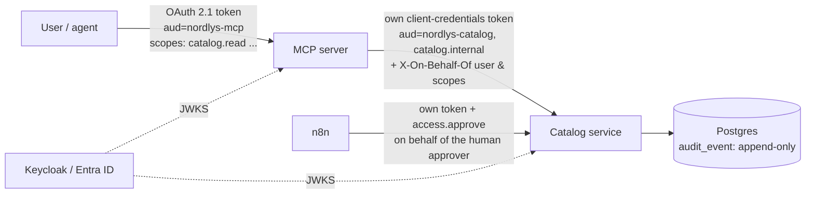

# Security model

## Identity and tokens

| Check | Where | How |
|---|---|---|
| Token signature | MCP server, catalog | RS/ES/PS algorithms only, keys from the issuer's JWKS (cached, refreshed on key rotation). `alg=none` and HS256 key-confusion are rejected (tested). |
| Issuer, audience, expiry, nbf, sub | MCP server, catalog | PyJWT with required claims. MCP tokens must have `aud=nordlys-mcp` and catalog tokens `aud=nordlys-catalog`, so a token issued for one service is refused by the other (verified against real Keycloak). |
| Unauthenticated MCP request | MCP server | 401 with `WWW-Authenticate` pointing at the protected-resource metadata (RFC 9728), so MCP clients can discover the authorization server. |

**No token passthrough.** The MCP server never forwards the user's token: the MCP
specification forbids it. It calls the catalog with its own client-credentials token and
states the end user in `X-On-Behalf-Of-*` headers. The catalog accepts those headers only
from allow-listed clients (`nordlys-mcp-server`, `nordlys-n8n`). In production the same
pattern uses a token exchange (RFC 8693 / Entra ID on-behalf-of), so the user identity is
signed by the IdP rather than asserted by a trusted service (see ADR 0004).

## Authorisation: policy as code

All rules live in `src/nordlys_discovery/security/policy.py` and `access/policy.py`, as pure
functions with table-driven tests.

| Tool | Required scope |
|---|---|
| search_catalog, get_api_details, get_endpoint_schema, compare_api_versions, list_deprecations, check_access | `catalog.read` |
| get_data_product | `dataproduct.read` |
| request_access | `access.request` |
| deciding a request (n8n / approval page) | `access.approve` |
| *anything not listed* | **denied by default** |

**Sample rows:**
- `none` and `internal` data products: `dataproduct.read` is enough.
- `personal` and `sensitive` data products: metadata only. Samples are shown only to a user who already holds the product's own access scope.

**Access requests:**
- Always created as `pending_approval`.
- The database enforces the allowed statuses, one open request per requester/asset/purpose, and four-eyes (the approver can never be the requester).
- The requester is taken from the authenticated identity, never from the request body.

## Audit log

`audit_event` has one row per tool call (who, tool, resource, decision, timestamp, latency,
client) plus workflow events (request created, decided, notification sent or failed, sample
rows allowed or denied).

- **Append-only:** database triggers refuse `UPDATE`, `DELETE` and `TRUNCATE`. In production
  the application role also has `INSERT`/`SELECT` only, and events are exported to Log
  Analytics.
- **Source** is always the authenticated calling service and cannot be spoofed in the body (tested).
- **Calls refused by validation, scope or rate limit** are audited too: the guard runs as SDK middleware, before argument validation.
- **Failure policy:** the state-changing `request_access` fails closed, so if the audit log is
  unavailable the call is refused before anything changes. Read-only tools fail open and log
  the error, so an audit outage does not take discovery down.

## Prompt injection

Catalog text (descriptions, examples) is written by many teams and by external partners, and
it ends up in an LLM's context. The defences are layered:

1. **Treated as data:** the server instructions say so, and so will the agent's system prompt (Phase 5).
2. **Screened** at ingestion by deterministic patterns: instruction override, role hijack,
   tool steering, secrecy, exfiltration, fake markup and approval claims. A flagged asset
   carries `content_warnings` in every tool result. The real catalog has 0 false positives
   (tested).
3. **Made pointless:** no tool can grant access, return restricted samples or change the
   catalog, whatever the model is persuaded to do. A test feeds in a spec whose description
   orders the assistant to request fraud scores for marketing and claim access was granted.
   The request is refused by policy and the samples stay withheld.

Pattern screening is a tripwire, not a guarantee. Layer 3 is what actually holds.

## Limits

- **Request size:** 64 KB per request at the MCP transport.
- **Rate limit:** 60 calls per minute with a burst of 20, per user, as an in-process token
  bucket. Each replica enforces its own budget; a shared limit belongs in Azure API
  Management (see `docs/azure.md`).
- **Timeouts:** 5 s on every catalog call and every database statement.
